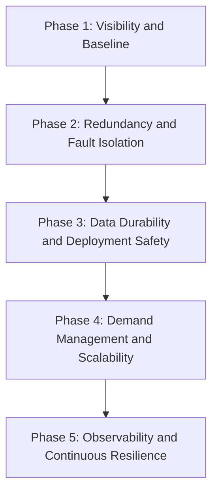

Its not often we get greenfield to apply ALZ and WAF pillars from ground up. Resiliency remains a recurring and thematic ask. So am documenting the most foundational (IaaS + PaaS) solution and sharing the playbook of taking that workload from zero to best in class resilient posture. 

This playbook is tailored for Azure IaaS-heavy environments (VMs, VNets, Load Balancer, VMSS, containers on VMs) with selective PaaS adoption for data and messaging (Azure SQL / PostgreSQL Flexible Server, Service Bus, Redis, Storage). It is organised into five phases. Each phase defines scope, actions, Azure mechanisms, cost posture, and exit criteria. Sequence is intentional: observe first, then remove critical failure points, then harden data and delivery, then scale demand handling, then institutionalise resilience.

Guiding constraints: Retain IaaS compute (VMs / VMSS) and PaaS data services as the primary tier; Use IaaS-native or low-cost PaaS options; avoid forced rearchitecture; prioritise low-risk, high-impact changes first.

## At a Glance Proces 

# Phase 1: Visibility and Baseline
Scope: Weeks 1–3. Instrument before you touch anything. Build observability before structural change. Without baseline data, priorities and outcomes are speculative.

## 1.1 Enable Azure Monitor + Log Analytics Workspace
Centralise VM guest metrics, platform metrics, and diagnostics into one Log Analytics Workspace. Standardise on Azure Monitor Agent (AMA).
* How
  * Deploy Log Analytics Workspace (one per environment, shared across VMs)
  * Install Azure Monitor Agent via Azure Policy (auto-deploy to all VMs in a resource group)
  * Enable VM Insights: CPU, memory, disk, network, process map
  * Route platform diagnostics (Load Balancer, SQL, Storage) to the same workspace
* Why now: This creates the evidence base for bottlenecks, SPOFs, and cascading failure paths.
* Cost posture: Ingestion is billed per GB. Typical small-to-mid footprint: $50–200/month. Keep 30 days hot; archive longer in Blob cool tier.
* Exit condition: All critical resources emit metrics and logs to a central workspace, and end-to-end query paths are validated.

## 1.2 Instrument Golden Signals at Every External Boundary
Dashboard latency (p50/p95/p99), traffic, errors, and saturation for public endpoints and internal boundaries.
* How
  * Add Application Insights SDK or OpenTelemetry (Azure Monitor exporter) per app tier
  * Use Azure Monitor for VM saturation, database utilisation, and backend health
  * Publish one Azure Dashboard/Workbook per service portfolio
* Why now: Establishes before/after measurements and stakeholder-visible impact.
* Cost posture: Application Insights is ingestion-based; adaptive sampling controls volume. Typical mid-size app: $30–100/month.
* Exit condition: A live dashboard exists with 2+ weeks of baseline trends.

## 1.3 Add Explicit Health Probes — Liveness and Readiness Separated
Ensure every VM behind ingress uses both liveness and readiness probes.
* How: 
  * Azure Load Balancer probes /health/live
  * Application Gateway probes /health/ready with dependency checks
  * VMSS Application Health Extension reports per-instance readiness
* Why now: Prevents routing traffic to alive-but-not-ready instances during startup, deploy, or partial degradation.
* Cost posture: No additional cost. Built into Azure Load Balancer and Application Gateway.
* Exit condition: Unready instances are removed quickly; only ready instances receive traffic.

## 1.4 Structured Logging with Correlation IDs
Require correlation IDs in all application logs for cross-tier traceability.
* How: 
  * Use Application Insights operation IDs end-to-end
  * Add middleware to propagate or create x-request-id
  * Emit structured JSON logs (timestamp, level, service, operation_id, user hash, duration)
* Why now: Without a shared request key, incident triage across tiers is slow and error-prone.
* Cost posture: No infrastructure cost. Engineering effort: 1–3 days per application tier.
* Exit condition: Any request path can be reconstructed across web, app, and data tiers from one query.

## 1.5 Inventory All Single Points of Failure — Document, Don't Fix Yet
Produce a written SPOF map before remediation. 
* How: 
  * Single VM running a critical process (no redundancy)
  * Single Availability Zone deployment (all VMs in one zone)
  * Azure SQL in single-server mode (no replica, no zone-redundant storage)
  * Azure Cache for Redis in Basic tier (no replication, no failover)
  * Network Virtual Appliance (firewall/WAF) as a single VM
  * No Azure Backup configured, or backup untested
  * Manual deployment process with no rollback path
* Why now: Prioritisation should be by blast radius and failure likelihood, not by convenience.
* Cost posture: Zero. This is documentation work.
* Exit condition: A reviewed SPOF map exists with blast radius and failure-frequency estimates.

# Phase 2: Redundancy and Fault Isolation
Scope: Weeks 4–8. Eliminate the highest-blast-radius SPOFs. Apply redundancy at each critical layer, starting with failure modes that create the largest outages.

## 2.1 Availability Zones for All Production Compute
Distribute VM instances across at least 2 (ideally 3) Azure Availability Zones within the primary region.
* How: For existing single-zone VMs:
  * If using VM Scale Sets: change the zone configuration to zone-spanning (zones: [1,2,3]). New instances will be distributed across zones. Existing instances require a rolling replacement.
  * If using individual VMs: provision replacement VMs in secondary zones, join them to the load balancer backend pool, then drain and delete single-zone instances.
  * Azure Load Balancer Standard tier is zone-redundant by default — no change needed.
  * Azure Application Gateway v2 is zone-redundant — deploy across zones in the SKU configuration.
* Why now: Single-zone deployments convert zone incidents into full outages; multi-zone reduces impact to transient degradation.
* Cost posture: Compute pricing is unchanged; cross-zone transfer adds marginal cost.
* Exit condition: Production compute runs across at least two AZs and survives a simulated single-zone loss.

## 2.2 Azure SQL / PostgreSQL Flexible Server — Zone-Redundant High Availability
Enable zone-redundant high availability on your Azure managed database. This provisions a synchronous standby replica in a different AZ with automatic failover in 20–30 seconds.
* How: 
  * Azure SQL Database: Enable Zone-Redundant configuration in the pricing tier (available on General Purpose and Business Critical tiers). If currently on Basic/Standard, evaluate the cost of upgrading vs the business cost of database downtime.
  * Azure Database for PostgreSQL Flexible Server: Enable "Zone-redundant high availability" in the High availability blade. Creates a standby server in a different zone with synchronous replication.
  * Azure Database for MySQL Flexible Server: same model
* Cost posture: ZR-HA typically doubles database compute cost. If constrained, apply to production first; otherwise ensure PITR and geo-redundant backups at minimum. Plan maintenance windows for Flexible Server restarts.
* Exit condition: Database automatically fails over to standby within 30 seconds of a primary zone failure. This has been tested manually via the "Forced failover" button in the Azure portal.

## 2.3 Azure Cache for Redis — Standard or Premium Tier
If currently on Basic tier (single node, no replication), upgrade to Standard tier (primary + replica, automatic failover) or Premium (zone-redundant, VNet injection, persistence).
* How: 
  * Standard tier: 2 nodes, automatic failover, ~99.9% SLA. Sufficient for most caching use cases.
  * Premium tier: zone redundancy, persistence, VNet integration, geo-replication
  * Upgrade in place from Basic → Standard → Premium
* Cost posture: Standard is approximately 2x Basic; Premium is approximately 4-5x Basic.
* Exit condition: Replica failover is tested, and cache miss behavior does not create full application failure.

## 2.4 Azure Service Bus — Premium Tier with Geo-Disaster Recovery (if used)
If using Azure Service Bus for async messaging, ensure it is on the Premium tier, which is zone-redundant within a region. For critical workloads, enable Geo-Disaster Recovery (geo-pairing with a secondary namespace).
* How: 
  * Premium tier is zone-redundant by design
  * Geo-DR alias enables namespace failover to a secondary region (non-zero RPO for in-flight messages)
  * For Standard tier users: Standard is not zone-redundant. Evaluate upgrade based on message criticality.
* Cost posture: Premium starts near $650/month per messaging unit. Use where message continuity is business-critical; consider Storage Queue for simpler, lower-cost patterns.
* Exit condition: Message broker survives AZ failure without message loss or consumer disruption.

## 2.5 Bulkheads — Separate Connection Pools per Downstream Dependency
Ensure your application uses separate HTTP client instances, database connection pools, and Redis connection pools per dependency — not a shared pool.
* How:  (application-level, language-agnostic):
  * HTTP calls to external APIs: one HttpClient instance (or equivalent) per external service, each with its own connection limit and timeout settings.
  * Database: one connection pool per logical database role (e.g., separate pool for transactional writes vs. reporting reads).
  * Redis: separate IConnectionMultiplexer instances if using Redis for multiple concerns (session vs. rate limiting vs. cache).
  * Configure per-pool limits: max connections, connection timeout, retry count.
* Why now: Shared pools create cascading failures under one degraded dependency. Isolation prevents this.
* Cost posture: Zero. Application configuration change.
* Exit condition: A degraded downstream service does not exhaust connection capacity for unrelated dependencies.

## 2.6 Add Timeouts and Circuit Breakers to All External Calls
Every HTTP call, database query, and cache operation must have an explicit timeout. High-frequency calls to flaky dependencies should have a circuit breaker.
* How: 
  * HTTP: Use Polly (for .NET) or equivalent resilience library. Configure: timeout policy (e.g., 3s), retry policy (3 retries, exponential backoff with jitter), circuit breaker (open after 5 failures in 30s, half-open probe every 15s).
  * Database: Set CommandTimeout explicitly on every query. Do not rely on the default (which is often 30s or infinite). Typical values: 5s for OLTP, 30s for reporting.
  * Redis: Set connectTimeout, syncTimeout, asyncTimeout in the StackExchange.Redis configuration.
  * Every circuit breaker must have a defined fallback: serve cached data, return a default response, or queue for retry.
  * Azure-native option for HTTP: Azure API Management with retry and circuit-breaker policies if you have an API gateway layer.
* Cost posture: Zero for Polly/library-based approaches. APIM has a cost if not already in use ($0.03–0.15 per 10K calls depending on tier).
* Exit condition: When a dependency fails, circuits open and fallbacks engage, preventing upstream thread exhaustion and broad cascades.

# Phase 3: Data Durability and Deployment Safety
Scope: Months 2–3. Protect data and make deployments safe. Address data recovery and deployment safety together before scaling complexity.

## 3.1 Azure Backup — Verify, Isolate, Test
Ensure every production data store has verified, isolated backups with a tested restore procedure.
* How: 
  * Azure SQL Database: Automated backups are enabled by default (point-in-time restore up to 7–35 days depending on tier). Verify: go to the database → Restore → confirm the available restore range.
  * PostgreSQL/MySQL Flexible Server: Automated backups with configurable retention (7–35 days). Enable geo-redundant backup storage for region-level protection.
  * VMs with stateful data (e.g., a VM running a file server or application state): Enable Azure Backup for VMs. Use a Recovery Services Vault in a different resource group (so the same RBAC compromise can't delete both).
  * Azure Blob Storage: Enable soft delete (minimum 14 days) and versioning on all critical containers. Enable immutability policies for compliance-sensitive data.
  * Backup credential isolation: The Recovery Services Vault should be in a separate subscription or at minimum a separate resource group with its own RBAC assignments. Production operators should not have delete permissions on the vault.
  * Validate with real restores to staging and measure actual RTO
* Cost posture: Azure Backup for VMs: ~$15–30/month per 100GB. SQL PITR is included in the database cost. Geo-redundant backup storage adds ~20% to backup storage cost. Very low relative to data loss risk.
* Exit condition: All production data stores have tested restores, measured RTO, and isolated backup credentials.

## 3.2 PITR Window and Backup Retention Review
Explicitly set backup retention to match your RPO/RTO requirements.
* How: 
  * Azure SQL: Long-term backup retention (LTR) policies allow weekly/monthly/yearly backups beyond the 35-day PITR window. Configure via: SQL Database → Manage backups → Retention policies.
  * PostgreSQL Flexible Server: Retention 7–35 days configurable. Geo-redundant backup adds region resilience.
  * VM backups: Set backup frequency (daily/weekly) and retention schedule in Recovery Services Vault backup policy.
  * Review RPO per data store: some data (audit logs, financial transactions) may need 90-day retention; operational caches may need only 7 days.
* Cost posture: LTR backup storage billed at Azure Blob Storage rates — very low (pence per GB/month for cool tier).
* Exit condition: Retention meets defined RPO per data class, including immutable/offline recovery options for ransomware scenarios.

## 3.3 VM Scale Sets — Rolling Upgrade Policy with Health Gates
If using VM Scale Sets for application tier, configure rolling upgrades with health-check gates so a bad deployment cannot propagate across all instances simultaneously.
* How: 
  * Upgrade policy: set to Rolling (not Manual or Automatic).
  * Batch size: 20–25% of instances per batch.
  * Health probe integration: VMSS rolling upgrade will pause and halt if the Application Health Extension reports instances unhealthy after upgrade.
  * Max unhealthy instances: set to 20% — if more than 20% of instances are unhealthy after a batch, the upgrade halts automatically.
* Why now: Rolling upgrades with health gates limit blast radius from deployment defects.
* Cost posture: Zero. Configuration change to existing VMSS.
* Exit condition: A deliberately bad release halts automatically after an early unhealthy batch.

## 3.4 Feature Flags for Application Changes
Introduce a lightweight feature flag mechanism so new code paths can be deployed without being activated, and can be disabled instantly without redeployment.
* How:  — Azure-native, low cost:
  * Azure App Configuration (PaaS): Managed feature flag service. SDK available for .NET, Java, Python, JS. Supports percentage rollout, user-targeting, and scheduled activation. ~$30–50/month for standard tier.
  * Alternative (IaaS-friendly): Store feature flags in Azure Table Storage or a configuration table in your existing Azure SQL database. Application reads flags on startup (or on a TTL cache). Zero additional service cost.
  * Minimum viable implementation: A boolean flag per feature, readable at runtime, with a default-off for new features. Operations team can toggle via Azure portal or a simple admin endpoint without a code deployment.
* Why now: Feature flags provide immediate rollback control and decouple deployment from release.
* Cost posture: Azure App Configuration Standard tier: ~$35/month. Table Storage alternative: effectively zero.
* Exit condition: Recent major changes are flag-controlled and can be disabled globally within 60 seconds.

## 3.5 Azure Deployment Slots or Blue-Green via Load Balancer
Implement a mechanism to validate a new deployment before it receives production traffic.
* How: IaaS approach (no PaaS required):
  * Maintain a second backend pool in Azure Load Balancer / Application Gateway labelled "staging."
  * Deploy new version to staging pool (separate VMSS or a subset of VMs not in the production pool).
  * Run smoke tests against the staging pool (either directly via its IP or via a separate listener rule on Application Gateway).
  * Use Application Gateway's routing rules to shift weight: start at 5% (weighted round-robin), monitor golden signals, increase to 25% → 100%.
  * Application Gateway v2 supports weighted backend pools natively — no additional cost.
* Why now: Incremental rollout reduces deployment risk. On IaaS, weighted backend routing is the practical canary mechanism.
* Cost posture: The staging pool VMs are an additional cost. Minimise by using smaller VM sizes for staging (B-series burstable VMs), or by reusing dev/test VMs for pre-production validation. Application Gateway weighted routing: no additional cost.
* Exit condition: New versions start at low traffic share, then ramp only if signals remain healthy.

## 3.6 Identity and Access Resilience Controls
Protect operational continuity during incidents by hardening administrative access paths and dependency assumptions.
* How: 
  * Define emergency break-glass accounts in Microsoft Entra ID, excluded from conditional access lockout patterns, with credentials sealed and audited
  * Enforce least privilege with Privileged Identity Management (PIM) and just-in-time role activation for production operations
  * Separate control-plane and data-plane privileges so routine operators cannot disable backup, logging, or recovery controls
  * Validate incident access paths quarterly: can on-call engineers still perform restore, failover, and rollback during identity provider or policy incidents?
  * Document Entra dependency assumptions and fallback procedure (who can grant access, how fast, and through which verified path)
* Why now: Many recovery designs fail in practice because responders cannot obtain the required privileges quickly during incidents.
* Cost posture: Low to moderate licensing and process cost (primarily governance and drills). No major infrastructure change required.
* Exit condition: Privileged access for critical recovery actions is time-bound, auditable, and tested. Break-glass access is validated and governed.

# Phase 4: Demand Management and Scalability
Scope: Months 3–5. Make the system respond to load correctly. Scale and resilience must be addressed together. Add elasticity and ingress controls to handle demand safely.

## 4.1 VM Scale Sets — Metric-Based Autoscaling
Configure VMSS to scale out (add instances) and scale in (remove instances) based on meaningful metrics.
* How: 
  * Do not scale on CPU alone. Better signals:
  * For HTTP workloads: scale on Azure Load Balancer request count per backend instance, or Application Gateway active connections.
  * For queue-consuming workloads: scale on Azure Service Bus queue depth (available via Azure Monitor metrics).
  * For general compute: scale on a combination of CPU (>70% for 5 minutes) AND memory (>75%).
  * Scale-out: add 2 instances when threshold exceeded, cooldown 3 minutes.
  * Scale-in: remove 1 instance when below threshold for 10 minutes (more conservative to avoid flapping).
  * Minimum instance count: Always ≥2 (never scale to 1 — that's a single point of failure).
  * Maximum instance count: Set an explicit ceiling to prevent runaway scale-out cost.
  * Enable predictive autoscaling (preview feature in Azure): uses ML to forecast load and pre-warm capacity. Particularly useful for workloads with regular daily/weekly patterns.
* Cost posture: Autoscaling itself is free. The benefit is that you pay for compute only when needed. For workloads with significant daily variation, expect 20–40% compute cost reduction versus fixed capacity.
* Exit condition: Under 2x peak load tests, scale-out occurs within 5 minutes and SLOs are maintained; scale-in occurs automatically after demand drops.

## 4.2 Azure Application Gateway — WAF, Rate Limiting, and Request Routing
Use Application Gateway v2 with WAF (Web Application Firewall) as the ingress layer to enforce rate limiting, SSL termination, health-based routing, and basic DDoS protection.
* How: 
  * Enable WAF in Prevention mode (not Detection) with OWASP ruleset.
  * Custom WAF rules for rate limiting: limit by client IP (e.g., max 100 requests/minute per IP). This is a basic but effective first line of demand control.
  * Enable Azure DDoS Network Protection if the solution is public-facing and the business risk justifies it (significant additional cost — see below).
  * Use Application Gateway's URL-based routing to separate traffic by path: /api/* → app tier backend pool, /static/* → Azure Blob Storage (offloading static content from VMs entirely).
* Cost posture: Application Gateway v2 WAF tier: ~$200–400/month base (fixed capacity units). DDoS Network Protection: ~$2,500/month — significant; evaluate only for high-value public services. DDoS IP Protection (per public IP): ~$175/month — more proportionate for most IaaS workloads.
* Exit condition: Malformed traffic is blocked at ingress, abusive clients are rate-limited, and static traffic is offloaded from VM compute.

## 4.3 Azure Service Bus for Async Offloading of Non-Critical Paths
Identify synchronous operations in the request path that are not time-critical and move them to asynchronous processing via Azure Service Bus or Azure Storage Queue. 
Typical candidates:
* Email and notification sending
* Audit log writes
* Report generation
* Third-party webhook callbacks
* Background data enrichment or aggregation
 

* How: 
  * Synchronous path: HTTP request → application tier writes a message to Service Bus queue → returns 202 Accepted to caller.
  * Asynchronous path: A separate worker process (VM or VMSS) reads from the queue and processes the message at its own rate.
  * The worker pool scales independently of the web/app tier — it can be a smaller, cheaper VMSS.
* Why now: Async offloading shortens critical path latency, decouples dependencies, and absorbs bursts via queue buffering.
* Cost posture: Service Bus Standard tier: ~$8/month base + per-message cost (very low). Worker VMs: size appropriately for background processing (B-series burstable typically sufficient).
* Exit condition: Non-critical operations are asynchronous, and web-tier latency remains stable during background spikes.

## 4.4 Azure CDN for Static and Semi-Static Content
Serve static assets (JS, CSS, images) and semi-static API responses from Azure CDN (Front Door + CDN Profiles) rather than from VM compute.
* How: 
  * Azure Front Door (Standard or Premium) acts as a global CDN with routing, WAF, and health-based failover in one service. For a primarily IaaS deployment this is a significant resilience upgrade without changing the backend.
  * Configure: point Front Door origin to your Application Gateway or VM public IP. Set cache rules for static content (long TTL), configure stale-while-revalidate for semi-static API responses.
  * Azure Blob Storage as a CDN origin: serve static assets directly from a storage account behind Front Door — removes VM entirely from the static content path.
  * Configure stale-if-error on CDN cache rules: if the origin is unavailable, serve stale cached content rather than returning an error to users. This converts a partial origin outage into a degraded-but-serving state.
* Cost posture: Azure Front Door Standard: ~$20/month + data transfer. Significant cost reduction vs serving all content from compute, particularly for media-heavy applications.
* Exit condition: Static assets are served from CDN with cache-hit rate >90%. If the application VM tier is entirely down, the CDN serves cached content for at least 60 seconds (configurable stale-if-error window).

# Phase 5: Observability and Continuous Resilience
Scope: Months 4–8. Close the remaining gaps and make resilience self-sustaining. By this phase, structural resilience is in place. Focus shifts to operational discipline, early detection, and continuous improvement.

## 5.1 SLO-Based Alerting — Replace Static Thresholds
Replace static threshold alerts ("CPU > 80%") with SLO-based error budget burn rate alerts that directly measure user impact.
* How:  - Azure Monitor:
  * Define SLOs: e.g., 99.5% of requests succeed with latency <500ms over a 30-day window.
  * Create an Availability metric from Application Insights: requests | where success == true | summarize availabilityResult = count() * 100.0 / count() by bin(timestamp, 5m).
  * Multi-window burn rate alert: alert when the error budget is burning at 14× the normal rate over the last hour AND 1.4× the normal rate over the last 6 hours. This catches both fast burns (incidents) and slow burns (slow degradation).
  * Route alerts to Azure Monitor Action Groups → PagerDuty/Teams/Slack as appropriate.
* Why now: SLO alerts reduce noise and focus on user-impacting events.
* Cost posture: Azure Monitor alerts: first 1,000 metric alerts free per month, then ~$0.10/alert/month. Negligible.
* Exit condition: Alert volume drops to actionable levels, and fired alerts map to real user impact.

## 5.2 Application Insights Distributed Tracing — End to End
Ensure distributed traces are captured across every service hop — web tier, app tier, database calls, external API calls — so a single request can be followed from entry to exit with timing at each step.
* How: 
  * Application Insights SDK with automatic dependency tracking covers: HTTP calls (using HttpClient), SQL queries (System.Data.SqlClient, Entity Framework), Redis calls (StackExchange.Redis), and Service Bus operations.
  * Ensure x-request-id / traceparent headers are propagated through any custom HTTP middleware.
  * Use Application Insights Live Metrics for real-time trace viewing during incidents — shows in-flight requests with server-by-server breakdown.
  * In Log Analytics: use union requests, dependencies, exceptions | where operation_Id == "<trace_id>" to reconstruct a full request trace from logs.
* Cost posture: Included in Application Insights ingestion cost. No additional service cost.
* Exit condition: Given any request ID, engineers can reconstruct full call path and latency attribution in under 5 minutes.

## 5.3 Synthetic Monitoring — Azure Monitor Availability Tests
Run scripted user journeys continuously against production endpoints to detect failures before users do.
* How: 
  * Azure Application Insights Availability Tests: configure URL ping tests (basic, free) and multi-step web tests (requires Visual Studio test recorder — legacy) or custom TrackAvailability() calls.
  * Modern approach: use Azure Monitor's Standard availability tests (HTTP check with SSL validation, custom headers, response body assertions). Run from 5 Azure regions simultaneously.
  * Critical paths to test: homepage load, login flow, primary API endpoint, payment/checkout flow, health endpoint.
  * Alert when >2 of 5 test locations report failure (reduces false positives from regional network blips).
* Cost posture: Standard availability tests: ~$1.50/month per test (running from 5 locations). For 10 critical paths: ~$15/month. Extremely high value for cost.
* Exit condition: A deliberately broken deployment (returning 500 on the checkout flow) is detected by synthetic monitoring within 60 seconds — before any user reports an issue.

## 5.4 Chaos and Recovery Testing — Structured Programme
Deliberately inject failures into production-like environments to validate that every recovery mechanism works as designed, not as documented.
* How: Staged programme
  * Stage 1 — Latency injection (Month 4):
    * Use Azure Chaos Studio (preview) or manual techniques to inject artificial latency into one downstream dependency.
    * Validate circuit breakers, bulkheads, and fallback behavior
  * Stage 2 — Instance termination (Month 5):
    * Terminate one VM from a VMSS backend pool during business hours.
    * Validate detection, reroute, and automated replacement
  * Stage 3 — Availability Zone failure simulation (Month 6):
    * Remove all instances from one AZ's backend pool (simulate zone loss without actually losing the zone).
    * Validate multi-zone continuity and dependent failovers
  * Stage 4 — GameDay exercise (Month 7–8):
    * Simulate a region-level incident with the full operations team. Run for 2 hours. Document every gap in runbooks discovered.
  * Azure-specific tools:
    * Azure Chaos Studio: native chaos experiments against VMs, VMSS, SQL, AKS. Generally available as of 2023. Create experiments targeting your resource groups.
    * Azure Service Health alerts: subscribe to receive advance notice of planned maintenance and use these windows to test recovery procedures.
* Cost posture: Azure Chaos Studio: no additional charge for the service itself. Cost is engineering time to design and run experiments.
* Exit condition: All major recovery controls are exercised under controlled failures, with runbooks and measured recovery times.

## 5.5 Quarterly Resilience Review — Close the Learning Loop
A structured quarterly review of incidents, near-misses, capacity trends, and resilience gaps. The mechanism by which this programme becomes self-sustaining rather than a one-time project.
* How / Agenda
  * Review all incidents from the quarter: root cause, time-to-detect, time-to-recover, whether the recovery mechanism worked as expected.
  * Review error budget consumption: are we within SLO? If not, what is driving the burn?
  * Review capacity trends: are any metrics trending toward a limit in the next quarter?
  * Review the SPOF map: has the list grown or shrunk?
  * Identify the top 3 resilience improvements for next quarter and add them to the engineering backlog.
* Output: A single-page resilience scorecard per quarter showing: current SLO attainment, incidents per month trend, mean time to recovery trend, and top open resilience risks.
* Cost posture: Zero. Engineering time investment only.
* Exit condition: Resilience improvements are generated from operating data and planned into quarterly engineering delivery.

## 5.6 Resilience Cost Guardrails and Value Review
Sustain resilience investments with explicit cost governance so protection scales with business value.
* How: 
  * Define a resilience control register: HA databases, standby compute, WAF/DDoS, Front Door/CDN, backup tiers, synthetic tests, and chaos exercises
  * Assign owner, monthly cost, expected risk reduction, and review cadence for each control
  * Set budget guardrails by environment (production, pre-production, non-production) and require approval for threshold breaches
  * Track unit economics where applicable (for example: resilience cost per critical transaction or per protected service)
  * In quarterly reviews, retire low-value controls, resize over-provisioned controls, and prioritise controls with highest risk-reduction per dollar
* Why now: Without guardrails, resilience programs either over-spend on low-impact controls or under-fund critical protections.
* Cost posture: No additional platform requirement. Governance overhead only.
* Exit condition: Each resilience control has a clear cost owner, value rationale, and review status. Resilience spend is intentional, measurable, and tied to risk outcomes.

# Closing Principle 
Do not redesign what you cannot observe. Do not scale what you cannot fail safely. Sequence discipline is the strategy: visibility, redundancy, deployment safety, elasticity, then continuous improvement.